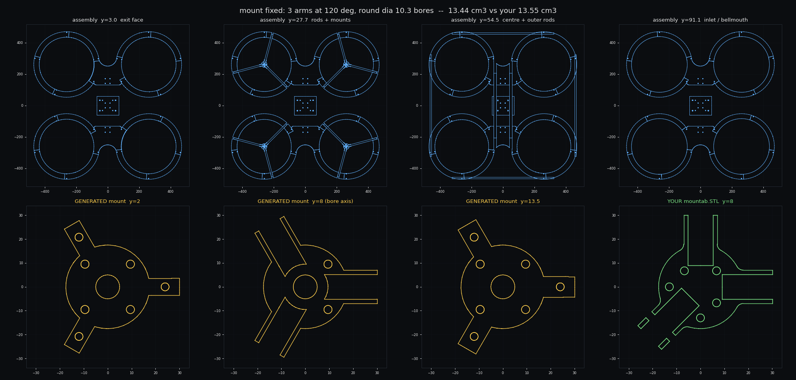
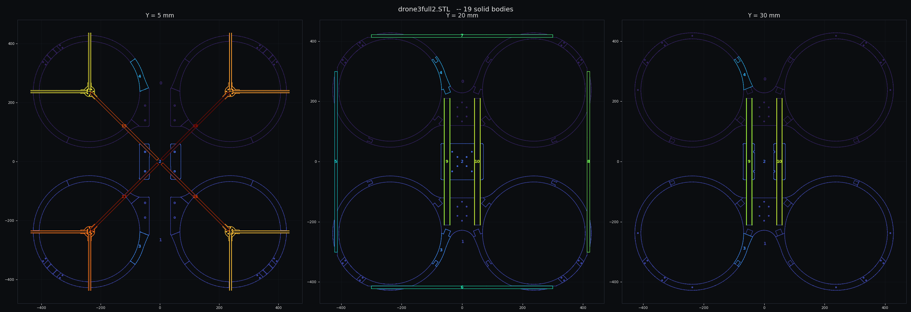

# ductgen

A parametric generator for 3D printed ducted quad frames. You give it a prop
size, a motor and your printer's bed. It derives the duct section from the
aerodynamics, splits the ring into the fewest pieces that still fit on the
plate, and builds the parts as SLDPRT, STEP and STL, plus a report and a
placement table.

from measurements of my own 13" ducted quad, so every default in the
code is a number taken off that airframe. The measurements are written up in
[REFERENCE.md](REFERENCE.md).



*reference drone regenerated from `presets/reference_drone3.json`. The three
red rows are why I wrote the tool: the as-built inlet lip is 0.7% of the prop
diameter and the chord is 12%. Swap in the derived section and they go green
([docs/preview-derived.png](docs/preview-derived.png)).*

## What you need

Python 3.10 or newer with numpy and matplotlib. That covers `preview`,
`section`, `layers` and `report`, which is all of the design work and touches no
CAD at all.

For solid models you need one of two backends:

* **SolidWorks**, driven over COM through pywin32. Windows only. Tested on
  SolidWorks 2025, rev 33.4.1.
* **build123d**, which is Python on top of OCCT. No CAD licence, no Windows.

## Install

```
git clone https://github.com/jackgibbons85/ductgen
cd ductgen
install.bat
```

installs numpy, matplotlib and pywin32. build123d is optional and is not
pulled in by default:

```bash
pip install build123d
```

build123d wants a normal CPython 3.10 to 3.12, not the Windows Store build,
because that is what the OCP wheels are compiled against.

## Running it

Three ways in, all on the same engine.

### The window

Double-click `ductgen-gui.pyw`. Change the prop, the kV or the bed and the
segment count, plate size and every OK/WARN/FAIL update as you type. Bed presets
for A1, A1 mini, X1C, MK4, XL, Ender 3, K1 Max, Voron and Neptune 4 live in
`presets/printers.json`. The Build button in the window uses the SolidWorks
backend.

### From inside SolidWorks

The same window can go on a SolidWorks toolbar button, so parts are created in
the session you already have open. Setup is a few steps and takes about thirty
seconds, see [macro/README.md](macro/README.md).

### Command line

```bash
python -m ductgen preview -p presets/13in_a1.json           # PNG and report, no CAD needed
python -m ductgen report  -p presets/reference_drone3.json  # numbers only
python -m ductgen build   -p presets/13in_a1.json -o out/13in
python -m ductgen preview -p presets/13in_a1.json prop.diameter_in=5 printer.bed_x=180
```

Any parameter can be overridden with a dotted key, as in the last line.
`dump` prints the whole parameter set as JSON, `set` writes it back to a preset
file, and `layers` renders the frame as stacked transparent PNGs.

## The two backends

`build` drives SolidWorks over COM by default:

```bash
python -m ductgen build -p presets/13in_a1.json -o out/13in
python -m ductgen build -p presets/13in_a1.json -o out/13in --hidden     # no SolidWorks window
python -m ductgen build -p presets/13in_a1.json -o out/13in --keep-open  # leave the parts open
```

Pass `--backend b3d` and it builds the same parts with
[build123d](https://github.com/gumyr/build123d):

```bash
pip install build123d
python -m ductgen build -p presets/13in_a1.json -o out/b3d --backend b3d
```

|  | SolidWorks (`sw`, default) | build123d (`b3d`) |
|---|---|---|
| needs | licence, Windows, pywin32 | `pip install build123d` |
| native files | SLDPRT and SLDASM, editable feature tree | none, kernel geometry only |
| exports | STEP, STL | STEP, STL |
| assembly | components placed in a SLDASM | components placed in one compound |
| speed | slower, every feature is a COM round trip | whole frame, 61 components, in about 9 seconds |

Both backends consume the same `Frame`, `RingPlan` and `segment_features()`, so
every design decision is shared and only the solid modelling differs. On the 13"
preset the two agree on part volumes to about 0.01%, which is the difference
between the SolidWorks spline fit and the OCCT one through the same bellmouth
points.

Use SolidWorks when you want a feature tree you can keep editing by hand. Use
build123d when you want the geometry on a machine with no CAD seat, in CI, or on
Linux. The planning half of the package imports no CAD either way, so `preview`,
`section`, `layers` and `report` run anywhere with numpy and matplotlib.

## What the inputs actually do

The inputs drive the geometry through the physics, and the tool pushes back when
the numbers do not work.

* **prop diameter to duct ID** at the tip clearance you asked for. Throat,
  chord, lip radius and prop-plane depth all scale off D.
* **kV by cells to rpm to tip Mach.** Cross 0.6 and it says so.
* **lip radius to duct OD.** A bellmouth at 6% of D needs 36 mm of radial room
  before there is any structure left, so ask for it inside a 20 mm wall and the
  section self-intersects. `duct_od` resolves that instead of letting the revolve
  fail, and the report says the ring got wider and why.
* **diffuser angle to expansion ratio sigma to ideal thrust gain**, (2σ)^(1/3),
  the static ducted-against-open figure at equal shaft power.
* **section and printer to mass**, at 3 walls and 15% infill, per ring and for
  four. At 13" a properly rounded duct is over a kilo of plastic, which is a real
  input to whether the duct is worth carrying at all.

`report` prints all of it with an OK / WARN / FAIL against each rule.

## Splitting for the bed

This is the part that otherwise gets done by hand.

1. **Fewest segments that fit.** The arc sector is tested at every in-plane
   rotation, so a 256 mm bed takes a 345 mm part on the diagonal. The 13" duct
   comes out as 4 segments of 98 degrees, 223 x 223 mm, 92% of the plate. A 3.5"
   ring prints whole.
2. **Joints kept off the strut roots.** The joint phase is chosen to maximise
   angular clearance to the nearest stator, so no glue line sits where the motor
   loads enter the ring.
3. **One part, N rotations.** Each segment is revolved symmetrically about the
   Front plane and gets an upper-half lap at one end and a lower-half lap at the
   other, which makes every segment of a ring the same part. You print one file
   16 times.

`analysis/verify_ring.py` re-imports the generated STL, rotates N copies and
confirms the ring closes with zero angular gap at four heights. It passes on the
shipped default:



bed profile lives in `printer.*`: name, X/Y/Z, edge margin, nozzle and
`allow_diagonal`.

## How the frame goes together

Joints are located by a blind stud pocket in each half of the lap, not by a bolt
through it. The carbon wrap is the structure and the pin only stops the two
halves sliding while the wrap goes on. Set `joint.stud = 0` to put through-bolts
back.

Rod sizes, bolt patterns and the centre plate all derive from the prop unless you
pin them, and derived rods snap onto tube sizes you can actually order. 13" gives
10 mm arms and a 20 mm spine, 5" gives 6 and 12. Nothing in the output is
5.3249 mm.

One arm per motor points at the machine centre, runs into the centre plate and is
bolted there rather than ending in mid air a centimetre past its own duct. That
is `rods.motor_inboard`, and it is why the plate is not symmetric about the
spine: the two rod heights are set independently and the plate has to reach down
to the lower one.

`ductgen.clash` checks that no two holes in a part run into each other, and
`check()` reports it as a design rule. Every hole comes from a different rule and
nothing else reconciles them, which is how motor bolts ended up opening into the
tube sockets on every frame the tool had built up to that point.

Every preset is checked the same two ways: the ring has to close through 360
degrees at every height, and every carbon rod has to have a clear path through
the printed parts. The second one catches a bore drilled into the wrong side of a
lap joint, or a connector with no bore for a rod that runs straight through it.

## Output

```
<name>_duct_segment*.SLDPRT / .STEP / .STL   the ring, one file per rod variant
<name>_motor_mount.SLDPRT / .STEP / .STL     x 4
<name>_strut.SLDPRT / .STEP / .STL           x 4 per ring
<name>_connector.SLDPRT / .STEP / .STL
<name>_center_plate.SLDPRT / .STEP / .STL
<name>_rod_*.SLDPRT / .STEP                  one per carbon rod length
<name>_frame.SLDASM / .STEP / .STL           every component placed
<name>_placement.json    where each copy goes: duct, x, y, rotation
<name>_report.txt        geometry, performance, rules, cut list, hardware
<name>_params.json       the exact inputs that produced this
```

The report also carries the carbon-rod cut list and a bolt count.

## Print orientation

Inlet face up, The bellmouth then recedes layer over layer and needs
no support. Inverted it is a full overhang right at the lip, which is the one
surface whose shape matters most. In the good orientation the only overhanging
bore surface is the diffuser, at 3 degrees from vertical.

The half-lap tab at one end of each segment is a shelf with air under it. Support
that face only, two small patches per part.

## Layout

```
ductgen/
  params.py      inputs, derived geometry, derived performance, design rules
  profile.py     the duct meridian section, one definition shared by the preview
                 and both CAD builders, so the PNG is what gets revolved
  segment.py     bed-fit splitter and joint phasing
  layout3d.py    where every part instance sits, and the rod runs
  clash.py       hole-against-hole interference check
  bridge.py      geometry helpers shared by the two backends
  preview.py     four-panel PNG: section, plan, plate, rule table
  swapi.py       SolidWorks COM wrapper (units, early binding, plane lookup)
  build_sw.py    duct segments and motor mounts in SolidWorks
  build_parts.py connector, centre plate and rods in SolidWorks
  build_asm.py   SolidWorks assembly
  build_b3d.py   the same parts and assembly in build123d
  gui.py         the desktop window, rules updating live
  cli.py         command line
analysis/        STL reverse-engineering scripts, ring and assembly checks
presets/         reference_drone3 (as-built), 13in_a1, cinewhoop_35, printers
macro/           DuctGen.bas, the SolidWorks toolbar launcher
tests/           geometry invariants, no CAD needed
```

##  misc

* Late-bound COM turns SolidWorks methods into properties, so `doc.GetTitle`
  returns a string instead of being callable. `swapi.module()` registers the
  typelib with makepy on first run and everything goes through the generated
  wrappers.
* `IFeatureManager::FeatureCut4` takes 27 arguments in 2025, not the 24 most
  published examples use. The extra three are `T0`, `StartOffset` and
  `FlipStartOffset`.
* `InsertRefPlane` returns an `IRefPlane`, and `ISketch` has no name at all.
  Both names come from `FeatureByPositionReverse(0)` instead.
* The Errors and Warnings arguments to `SaveAs3` are in/out, so they have to be
  passed in as well as read back.
* `swSTLDontTranslateToPositive` has to be set or the exporter shifts every part
  into the positive octant and throws away the placement. `swSTLShowInfoOnSave`
  has to be off or a modal dialog hangs the run.
* angled reference planes are the fragile part of the API, so the build avoids
  them entirely. The module docstring in `build_sw.py` has the symmetric revolve
  trick that makes that possible.

## Tests

```bash
python tests/test_geometry.py
```
checks the invariants that matter: the meridian never
self-intersects, the lip always fits inside the wall, N segments tile 360 degrees
exactly, joints never land on a strut root, a smaller bed never yields fewer
segments, the strut socket always leaves a ligament, every rod gets a clear path
and a screw over it, derived rods land on tube sizes you can buy, and
`presets/reference_drone3.json` still reproduces the measured drone. The
build123d cases run too if build123d is installed. CI runs the suite on every
push and uploads the rendered previews.

## Not done yet

* Assembly components are placed by transform, not mated. Mating is still manual.
* Centre fuselage and camera mount.
* `joint.kind` only implements `half_lap`. `dovetail` and `butt_pin` are declared
  but not built.
* CAD-side lightening of the duct. The section is solid right now and the slicer
  hollows it, which is why the mass estimate matters.
* Driving the segmentation from the rod angles rather than bed fit alone, so
  every rod lands at a segment centre by construction.

## Licence

MIT, see [LICENSE](LICENSE).
