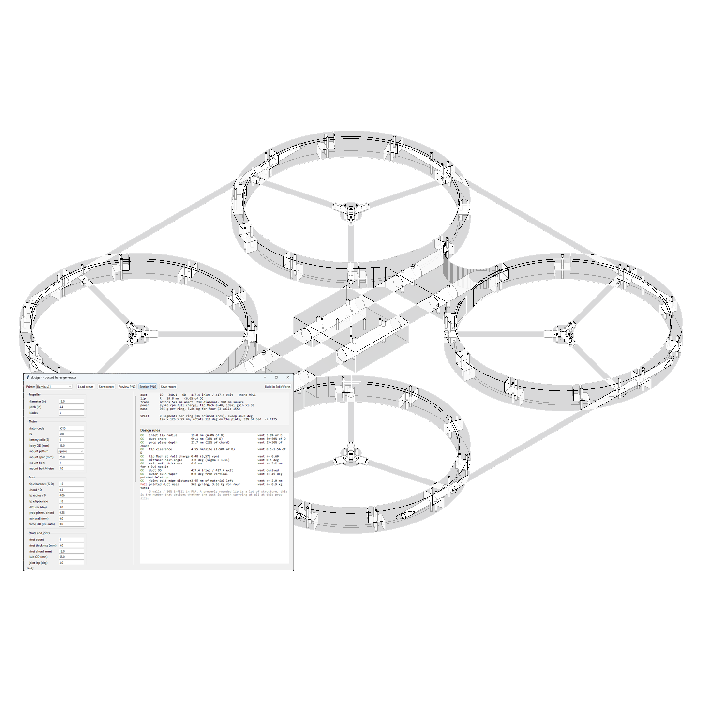
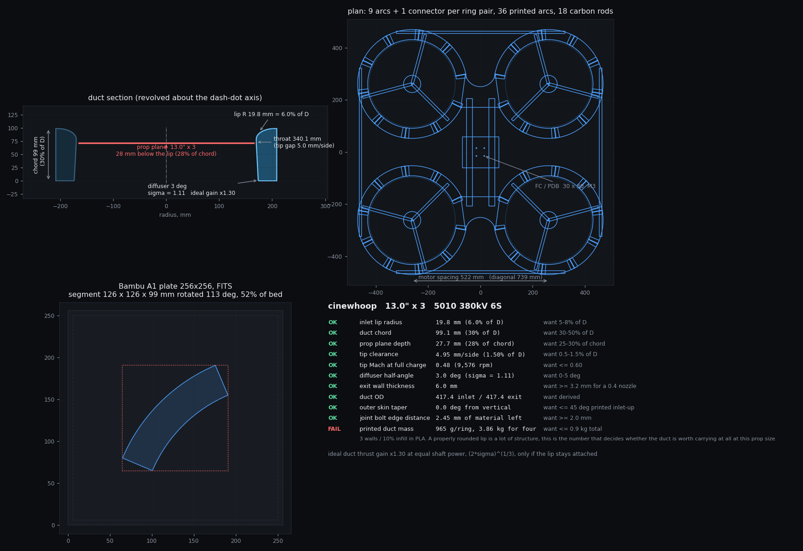

# ductgen

<div align="center">



**A parametric generator for 3D printed ducted quad frames**

[](LICENSE)
[](https://www.python.org/)
[](https://www.solidworks.com/)
[](https://github.com/gumyr/build123d)
[](https://github.com/jackgibbons85/ductgen/actions/workflows/ci.yml)

input a prop size/ motor and your printers bed size. gets the duct section from correct aerodynamics, splits the ring into the fewest pieces that still fit the plate, and builds the parts as SLDPRT, STEP and STL.

[Quick Start](#quick-start) • [Features](#features) • [Installation](#installation) • [Usage](#usage) • [Contributing](#contributing) • [Documentation](#documentation)

**[English](README.md)** | **[简体中文](README.zh-CN.md)** | **[Українська](README.uk.md)**

</div>

---

> [!NOTE]
> **Where this is up to**
>
> I built this from measurements of my own 13" ducted quad, so every default in the code is a number taken off that airframe. The design side (`preview`, `section`, `layers`, `report`) needs nothing but numpy and matplotlib and runs anywhere. The SolidWorks backend is tested on SolidWorks 2025, rev 33.4.1, on Windows only. The build123d backend runs anywhere Python does.
>
> Assembly components are placed by transform but not mated, and the duct is still solid in CAD rather than lightened. See the [Roadmap](#roadmap).

---

## Quick Start

```bash
git clone https://github.com/jackgibbons85/ductgen
cd ductgen
install.bat
python -m ductgen preview -p presets/13in_a1.json
```

That writes a preview PNG and a full report without touching CAD. Then either double-click `ductgen-gui.pyw` for the desktop window, or run `python -m ductgen build -p presets/13in_a1.json -o out/13in` to build the solids.

## Features

### Geometry

Change an input and the tool works out what it means, then tells you when the numbers do not add up.

- **Prop diameter to duct ID** at the tip clearance you asked for. Throat, chord, lip radius and prop-plane depth all scale off D.
- **kV by cells to rpm to tip Mach.** The 13" preset sits at Mach 0.48 on 9,576 rpm. Cross 0.6 and it says so.
- **Lip radius to duct OD.** A bellmouth at 6% of D needs 36 mm of radial room before there is any structure left. Ask for it inside a 20 mm wall and the section self-intersects, so `duct_od` resolves it instead of letting the revolve fail, and the report says the ring got wider and why.
- **Diffuser angle to expansion ratio sigma to ideal thrust gain**, (2σ)^(1/3), the static ducted-against-open figure at equal shaft power.
- **Section and printer to mass**, at 3 walls and 15% infill. The 13" duct comes out at 965 g per ring, 3.86 kg for four, which fails the rule on purpose. That number is what decides whether the duct is worth carrying at all.

Every rule is reported as OK, WARN or FAIL against what it wants.


*`preview` output: duct section, plan view, plate fit and the rule table, all in one PNG*

### Splitting for the Print Bed

This is the part that otherwise gets done by hand.

- **Fewest segments that fit.** The arc sector is tested at every in-plane rotation, so a 256 mm bed takes roughly a 345 mm part on the diagonal. The 13" duct comes out as 4 segments of 89 degrees each, 207 x 207 x 99 mm, 85% of the plate, 16 printed arcs for the whole aircraft. A 3.5" ring prints whole.
- **Joints kept off the strut roots.** The joint phase is chosen to maximise angular clearance to the nearest stator, so no glue line sits where the motor loads enter the ring.
- **One part, N rotations.** Each segment is revolved symmetrically about the Front plane and gets an upper-half lap at one end and a lower-half lap at the other, which makes every segment of a ring the same part. You print one file 16 times.
- **Bed presets included** for Bambu A1, A1 mini, X1C/P1S, Prusa MK4, Prusa XL, Ender 3, K1 Max, Voron 2.4 350 and Elegoo Neptune 4, in `presets/printers.json`.


*`analysis/verify_ring.py` re-imports the generated STL, rotates N copies and confirms the ring closes with zero angular gap at four heights*

### Two CAD Backends

The same `Frame`, `RingPlan` and `segment_features()` feed both, so every design decision is shared and only the solid modelling differs. On the 13" preset they agree on part volumes to about 0.01%, which is the difference between the SolidWorks spline fit and the OCCT one through the same bellmouth points.

|  | SolidWorks (`sw`, default) | build123d (`b3d`) |
| --- | --- | --- |
| **Needs** | Licence, Windows, pywin32 | `pip install build123d` |
| **Native files** | SLDPRT and SLDASM, editable feature tree | None, kernel geometry only |
| **Exports** | STEP, STL | STEP, STL |
| **Assembly** | Components placed in a SLDASM | Components placed in one compound |
| **Speed** | Slower, every feature is a COM round trip | Whole frame, 61 components, in about 9 seconds |

Use SolidWorks when you want a feature tree you can keep editing by hand. Use build123d when you want the geometry on a machine with no CAD seat, in CI, or on Linux.

### Desktop Window and SolidWorks Button

- **Live rules.** Change the prop, the kV or the bed and the segment count, plate size and every OK/WARN/FAIL update as you type.
- **Toolbar button.** The same window can go on a SolidWorks toolbar, so parts are created in the session you already have open. Setup takes about thirty seconds, see [macro/README.md](macro/README.md).
- **Presets in and out.** Load and save parameter JSON, or override anything on the command line with a dotted key.

### Checks That Run on Every Preset

- **Ring closure.** The ring has to close through 360 degrees at every height.
- **Rod paths.** Every carbon rod has to have a clear path through the printed parts. This is what catches a bore drilled into the wrong side of a lap joint, or a connector with no bore for a rod that runs straight through it.
- **Hole clashes.** `ductgen.clash` checks that no two holes in a part run into each other. Every hole comes from a different rule and nothing else reconciles them, which is how motor bolts ended up opening into the tube sockets on every frame the tool had built up to that point.
- **Against the real drone.** `presets/reference_drone3.json` has to keep reproducing the airframe I measured.


*Assembly slices at four heights, and the generated motor mount (orange) against the STL measured off the real drone (green), 13.44 cm³ against 13.55 cm³*

### Print Orientation

- **Inlet face up, every time.** The bellmouth then recedes layer over layer and needs no support. Inverted it is a full overhang right at the lip, which is the one surface whose shape matters most.
- **One overhang worth naming.** In the good orientation the only overhanging bore surface is the diffuser, at 3 degrees from vertical.
- **Minimal supports.** The half-lap tab at one end of each segment is a shelf with air under it. Support that face only, two small patches per part.

### putting it together

- **Studs, not bolts.** Joints are located by a blind stud pocket in each half of the lap. The carbon wrap is the structure and the pin only stops the two halves sliding while the wrap goes on. Set `joint.stud = 0` to put through-bolts back.
- **Orderable rod sizes.** Rod sizes, bolt patterns and the centre plate all derive from the prop unless you pin them, and derived rods snap onto tube sizes you can actually buy. 13" gives 10 mm arms and a 20 mm spine, 5" gives 6 and 12. Nothing in the output is 5.3249 mm.
- **Arms that land somewhere.** One arm per motor points at the machine centre, runs into the centre plate and is bolted there rather than ending in mid air a centimetre past its own duct. That is `rods.motor_inboard`, and it is why the plate is not symmetric about the spine.

---

## Requirements

| Part | Needs | Notes |
| --- | --- | --- |
| **Design side** | Python 3.10+, numpy, matplotlib | `preview`, `section`, `layers`, `report`. Any OS, no CAD. |
| **SolidWorks backend** | SolidWorks + pywin32, Windows | Tested on 2025, rev 33.4.1 |
| **build123d backend** | `pip install build123d` | Any OS. Wants a normal CPython 3.10 to 3.12, not the Windows Store build, because that is what the OCP wheels are compiled against. |

---

## Installation

```bash
git clone https://github.com/jackgibbons85/ductgen
cd ductgen
install.bat
```

That installs numpy, matplotlib and pywin32. build123d is optional and is not pulled in by default:

```bash
pip install build123d
```

---

## Usage

### Command Line

```bash
python -m ductgen preview -p presets/13in_a1.json           # PNG and report, no CAD needed
python -m ductgen report  -p presets/reference_drone3.json  # numbers only
python -m ductgen section -p presets/13in_a1.json           # just the duct meridian
python -m ductgen layers  -p presets/13in_a1.json           # stacked transparent PNGs
python -m ductgen build   -p presets/13in_a1.json -o out/13in
```

Override any parameter with a dotted key:

```bash
python -m ductgen preview -p presets/13in_a1.json prop.diameter_in=5 printer.bed_x=180
```

`dump` prints the whole parameter set as JSON and `set` writes it back to a preset file.

### Building With SolidWorks

```bash
python -m ductgen build -p presets/13in_a1.json -o out/13in
python -m ductgen build -p presets/13in_a1.json -o out/13in --hidden     # no SolidWorks window
python -m ductgen build -p presets/13in_a1.json -o out/13in --keep-open  # leave the parts open
```

### Building With build123d

```bash
pip install build123d
python -m ductgen build -p presets/13in_a1.json -o out/b3d --backend b3d
```

### Output

```
<name>_duct_segment*.SLDPRT / .STEP / .STL   the ring, one file per rod variant
<name>_motor_mount.SLDPRT / .STEP / .STL     x 4
<name>_strut.SLDPRT / .STEP / .STL           x 4 per ring
<name>_connector.SLDPRT / .STEP / .STL
<name>_center_plate.SLDPRT / .STEP / .STL
<name>_rod_*.SLDPRT / .STEP                  one per carbon rod length
<name>_frame.SLDASM / .STEP / .STL           every component placed
<name>_placement.json    where each copy goes: duct, x, y, rotation
<name>_report.txt        geometry, performance, rules, cut list, hardware
<name>_params.json       the exact inputs that produced this
```

The report also carries the carbon-rod cut list and a bolt count. On the 13" preset that comes to 40 joint studs at 2.5 mm and 16 M3 motor bolts.

### Tests

```bash
python tests/test_geometry.py
```

No CAD needed. It checks the invariants that matter and never self-intersects, the lip always fits inside the wall, N segments tile 360 degrees exactly, joints never land on a strut root, a smaller bed never yields fewer segments, the strut socket always leaves a ligament, every rod gets a clear path and a screw over it, rods land on tube sizes you can buy, and the reference preset still reproduces the measured drone. The build123d cases run too if build123d is installed. CI runs the suite on every push and uploads the rendered previews.

---

## Contributing

Contributions are welcome, whether that is a bug report, a feature idea, a fix or a new preset.

### How to Contribute

1. **Report issues.** Found a bug? [Open an issue](https://github.com/jackgibbons85/ductgen/issues/new)
2. **Suggest features.** Have an idea? [Email me](https://github.com/jackgibbons85/ductgen/discussions)
3. **Send a preset.** A printer profile or an airframe preset that works is genuinely useful.
4. **Write code.** Fork, branch, and make sure `python tests/test_geometry.py` still passes.

### Areas Needing Help

- **Linux and macOS testing** of the build123d backend, which is the only one that can run there
- **Older SolidWorks versions.** The COM calls are pinned to what 2025 expects, and `FeatureCut4` in particular changed argument count between releases
- **Printer profiles.** More entries for `presets/printers.json`
- **Airframe presets** with measurements behind them, the way `reference_drone3` has
- **Joint kinds.** `dovetail` and `butt_pin` are declared but not built
- **Translations.** This README is in English, Simplified Chinese and Ukrainian so far

---

## Documentation

- **[REFERENCE.md](REFERENCE.md)** - The measured drone every default traces back to
- **[macro/README.md](macro/README.md)** - Putting ductgen on a SolidWorks toolbar button
- **[DEVLOG.md](DEVLOG.md)** - Build log, including the SolidWorks API problems and how they were solved

### SolidWorks Notes 

here were some issues

- Late-bound COM turns SolidWorks methods into properties, so `doc.GetTitle` returns a string instead of being callable. `swapi.module()` registers the typelib with makepy on first run and everything goes through the generated wrappers.
- `IFeatureManager::FeatureCut4` takes 27 arguments in 2025, not the 24 most published examples use. The extra three are `T0`, `StartOffset` and `FlipStartOffset`.
- `InsertRefPlane` returns an `IRefPlane`, and `ISketch` has no name at all. Both names come from `FeatureByPositionReverse(0)` instead.
- The Errors and Warnings arguments to `SaveAs3` are in/out, so they have to be passed in as well as read back.
- `swSTLDontTranslateToPositive` has to be set or the exporter shifts every part into the positive octant and throws away the placement. `swSTLShowInfoOnSave` has to be off or a modal dialog hangs the run.
- Angled reference planes are the fragile part of the API, so the build avoids them entirely. The module docstring in `build_sw.py` has the symmetric revolve trick that makes that possible.

---

## Technology

### Core

- **Python 3.10+** - The whole engine
- **numpy** - Geometry maths
- **matplotlib** - Preview, section and layer rendering
- **Tkinter / ttk** - Desktop window

### CAD

- **SolidWorks 2025 API** - Driven over COM, via pywin32 early binding
- **build123d 0.9** - Python CAD on OCCT, the no-licence backend
- **VBA** - A thin launcher so the tool sits on a SolidWorks toolbar

### Tooling

- **GitHub Actions** - Runs the geometry suite and renders every preset on each push

### Layout

```
ductgen/
  params.py      inputs, derived geometry, derived performance, design rules
  profile.py     the duct meridian section, one definition shared by the preview
                 and both CAD builders, so the PNG is what gets revolved
  segment.py     bed-fit splitter and joint phasing
  layout3d.py    where every part instance sits, and the rod runs
  clash.py       hole-against-hole interference check
  bridge.py      geometry helpers shared by the two backends
  preview.py     four-panel PNG: section, plan, plate, rule table
  swapi.py       SolidWorks COM wrapper (units, early binding, plane lookup)
  build_sw.py    duct segments and motor mounts in SolidWorks
  build_parts.py connector, centre plate and rods in SolidWorks
  build_asm.py   SolidWorks assembly
  build_b3d.py   the same parts and assembly in build123d
  gui.py         the desktop window, rules updating live
  cli.py         command line
analysis/        STL reverse-engineering scripts, ring and assembly checks
presets/         reference_drone3 (as-built), 13in_a1, cinewhoop_35, printers
macro/           DuctGen.bas, the SolidWorks toolbar launcher
tests/           geometry invariants, no CAD needed
```

---

## License

MIT. See [LICENSE](LICENSE) for details.

---

## Acknowledgments

- [build123d](https://github.com/gumyr/build123d) by gumyr, which made the no-licence backend possible
- The SolidWorks API documentation and the forum posts that filled its gaps
- Every default here traces back to one real 13" airframe, written up in [REFERENCE.md](REFERENCE.md)

---

## Contact

Jack Gibbons, [jackgibbons@artyom.us](mailto:jackgibbons@artyom.us)

For bugs and feature requests an [issue](https://github.com/jackgibbons85/ductgen/issues/new) is better than email, since the answer stays where the next person can find it.

<div align="center">

**If ductgen is useful to you, a star on GitHub is appreciated.**

</div>
