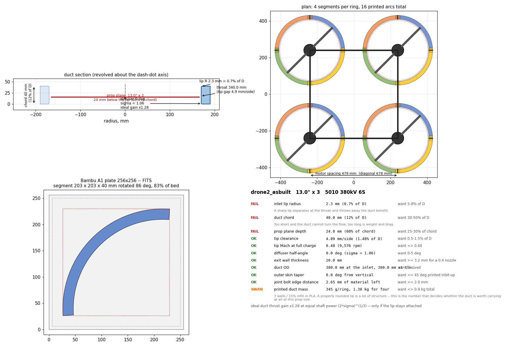
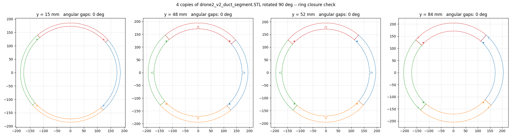

# ductgen — parametric ducted quad frame generator for SolidWorks

Give it a prop size, a motor, and your printer's bed. It derives the duct
section from the aerodynamics, works out how few pieces the ring can be split
into and still fit the plate, and builds the parts in SolidWorks — SLDPRT,
STEP and STL, plus a report and a placement table.

Built from measurements of an existing 13" ducted quad; every default is a
number taken off that airframe. See [REFERENCE.md](REFERENCE.md).



*The reference drone regenerated from `presets/reference_drone2.json`. The
three red rows are the reason this tool exists: a 0.7%-of-diameter inlet lip
and a 12%-of-diameter chord. Swap in the derived section and they go green
([docs/preview-derived.png](docs/preview-derived.png)).*

## Install

```
git clone https://github.com/jackgibbons85/ductgen
cd ductgen
install.bat
```

Then either **double-click `ductgen-gui.pyw`**, or put it on a SolidWorks
toolbar button so it behaves like part of SolidWorks — three clicks, see
[macro/README.md](macro/README.md).

The window carries the design rules live: change the prop, the kV or the bed
and the segment count, plate size and every OK/WARN/FAIL update as you type.
Bed presets for A1, A1 mini, X1C, MK4, XL, Ender 3, K1 Max, Voron and
Neptune 4 are in `presets/printers.json`.

Needs Python 3.10+ and SolidWorks (tested on 2025, rev 33.4.1). `preview` and
`report` need neither pywin32 nor SolidWorks, so the design side works on any
machine.

## Command line

```bash
python -m ductgen preview -p presets/13in_a1.json          # PNG + report, no CAD needed
python -m ductgen report  -p presets/reference_drone2.json # numbers only
python -m ductgen build   -p presets/13in_a1.json -o out/13in
python -m ductgen preview -p presets/13in_a1.json prop.diameter_in=5 printer.bed_x=180
```

Verified end to end against SolidWorks 2025 (rev 33.4.1).

## What makes the inputs mean something

The point is not that the sketch resizes. It is that the inputs drive geometry
through the physics, and the tool argues back when they do not add up.

* **prop diameter → duct ID** at the tip clearance you asked for, and the
  throat, chord, lip radius and prop-plane depth all scale off D.
* **kV × cells → rpm → tip Mach.** Cross 0.6 and it says so.
* **lip radius → duct OD.** A 6%-of-D bellmouth needs 36 mm of radial room
  before there is any structure left; ask for it inside a 20 mm wall and the
  section self-intersects. `duct_od` resolves that instead of letting the
  revolve fail, and the report tells you the ring got wider and why.
* **diffuser angle → expansion ratio σ → ideal thrust gain** (2σ)^(1/3), the
  static ducted-vs-open figure at equal shaft power.
* **section + printer → mass.** 3 walls and 15 % infill, per ring and for four.
  At 13" a properly rounded duct is over a kilo of plastic; that is a real
  input to whether the duct is worth carrying at all.

`report` prints all of it with an OK / WARN / FAIL against each rule.

## Splitting for the bed

This is the part that gets done by hand otherwise.

1. **Fewest segments that fit.** The arc sector is tested at every in-plane
   rotation, so a 256 mm bed takes a ~345 mm part on the diagonal. For the
   13" duct that is 4 segments of 98°, 223 × 223 mm, 92 % of the plate.
2. **Joints kept off the strut roots.** The joint phase is chosen to maximise
   the angular clearance to the nearest stator, so no glue line sits where the
   motor loads enter the ring.
3. **One part, N rotations.** Each segment is revolved symmetrically about the
   Front plane and gets an upper-half lap at one end and a lower-half lap at
   the other, which makes every segment of a ring the *same part*. You print
   one file 16 times.

`analysis/verify_ring.py` re-imports the generated STL, rotates N copies and
confirms the ring closes with zero angular gap at four heights. That check
passes on the shipped default:



Bed profile lives in `printer.*` — name, X/Y/Z, edge margin, nozzle, and
`allow_diagonal`.

## Output

```
<name>_duct_segment.SLDPRT / .STEP / .STL      x 4 per ring
<name>_motor_hub.SLDPRT / .STEP / .STL         x 4
<name>_strut.SLDPRT / .STEP / .STL             x 4 per ring
<name>_placement.json     where every copy goes: duct, x, y, rotation
<name>_report.txt         geometry, performance, rules, cut list, hardware
<name>_params.json        the exact inputs that produced this
```

Plus a carbon-rod cut list and a bolt count in the report.

## Print orientation

Inlet face **up**, every time. The bellmouth then recedes layer over layer and
needs no support; inverted it is a full overhang right at the lip — the one
surface whose shape you care about most. The only overhanging bore surface in
the good orientation is the diffuser, at 3° from vertical.

The half-lap tab at one end of each segment is a shelf with air under it.
Support that face only — two small patches per part.

## Layout

```
ductgen/
  params.py     inputs, derived geometry, derived performance, design rules
  profile.py    the duct meridian section -- one definition, shared by the
                preview and the CAD builder, so the PNG is what gets revolved
  segment.py    bed-fit splitter and joint phasing
  preview.py    four-panel PNG: section, plan, plate, rule table
  swapi.py      SolidWorks COM wrapper (units, early binding, plane lookup)
  build_sw.py   the actual part builds
  gui.py        the desktop window, with the rules updating live
  cli.py        command line
analysis/       the STL reverse-engineering scripts, and the ring-closure test
presets/        reference_drone2 (as-built), 13in_a1, cinewhoop_35, printers
macro/          DuctGen.bas -- the SolidWorks toolbar launcher
tests/          geometry invariants, no CAD needed
```

## Notes on the SolidWorks side

A few things cost time, recorded here so they do not cost it twice:

* Late-bound COM turns SolidWorks methods into properties — `doc.GetTitle`
  returns a string instead of being callable. `swapi.module()` registers the
  typelib with makepy on first run and everything goes through the generated
  wrappers.
* `IFeatureManager::FeatureCut4` takes **27** arguments in 2025, not the 24
  most published examples use; the extra three are `T0`, `StartOffset`,
  `FlipStartOffset`.
* `InsertRefPlane` returns an `IRefPlane`, and `ISketch` has no name at all —
  both names come from `FeatureByPositionReverse(0)` instead.
* `SaveAs3`'s Errors and Warnings are in/out, so they must be passed *in* as
  well as read back.
* `swSTLDontTranslateToPositive` has to be set or the exporter shifts every
  part into the positive octant and throws away the placement; and
  `swSTLShowInfoOnSave` has to be off or a modal dialog hangs the run.
* Angled reference planes are the fragile part of the API, so the build avoids
  them entirely — see the module docstring in `build_sw.py` for the symmetric
  revolve trick that makes that possible.

## Tests

`python tests/test_geometry.py` checks the invariants that matter and needs no
CAD: the meridian never self-intersects, the lip always fits inside the wall,
N segments tile 360 degrees exactly, joints never land on a strut root, a
smaller bed never yields fewer segments, the strut socket always leaves a
ligament, and `presets/reference_drone2.json` still reproduces the measured
drone. CI runs it on every push and uploads the rendered previews.

## Not done yet

* Assembly generation — the parts and a placement table are emitted, mating
  them is still manual.
* Centre fuselage and camera mount.
* `joint.kind` only implements `half_lap`; `dovetail` and `butt_pin` are
  declared but not built.
* CAD-side lightening of the duct. Right now the section is solid and the
  slicer hollows it, which is why the mass estimate matters.
* A `build123d` backend so the repo runs without a SolidWorks seat.
