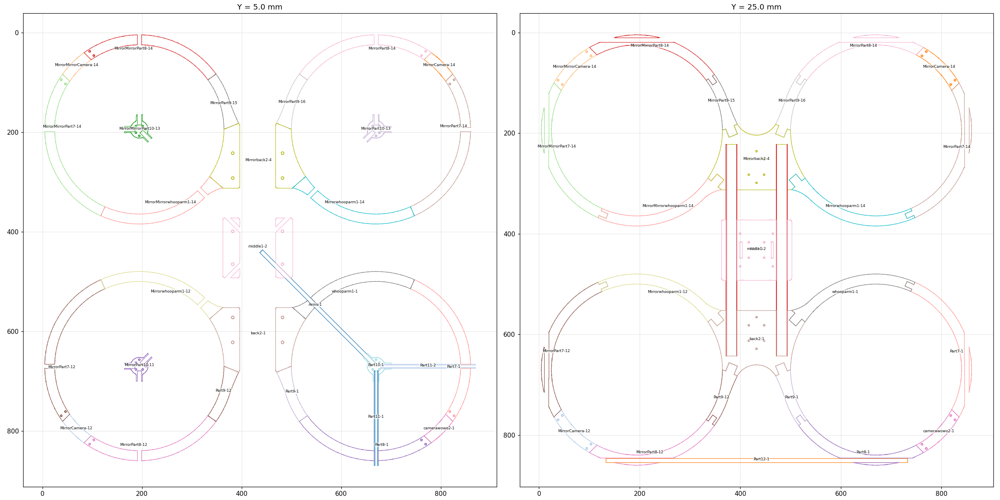

# Reference build, what was measured off `draaw.STL`

Every default in `ductgen/params.py` traces back to a number in this file.
Nothing here was assumed; each row says which script produced it and how.

Source: `OneDrive/Documents/solido/Artyom/draaw.STL` (7.8 MB, 155 320 triangles)
plus the 36 per-component exports `juiva - *^Drone2-*.STL`, which carry each
part at its assembly position. In those files **Y is up**.

*`analysis/plot.py` output: every component of `Drone2` sliced at y = 5 and
y = 25, coloured per part. This is what the five-arc split and the lap joints
were read off.*

## Tools used

| script | what it does |
|---|---|
| `analysis/stlread.py` | binary STL reader, bbox, signed volume, area |
| `analysis/components.py` | vertex weld + union-find to split a mesh into solid bodies |
| `analysis/section.py` | plane-slices a mesh, reports radius/angle clusters |
| `analysis/profile.py` | pulls the meridian profile at a fixed azimuth |
| `analysis/holes.py` | finds vertical cylindrical faces and least-squares fits them |
| `analysis/span.py` | angular span and radial range of each part about its motor axis |
| `analysis/plot.py` | top-view slices of the whole assembly |
| `analysis/verify_ring.py` | re-assembles a generated segment into a ring and checks closure |

## The airframe

| quantity | measured | how |
|---|---|---|
| overall footprint | 864.45 × 864.45 × 66.00 mm | bbox of `draaw.STL` |
| motor spacing | 479.29 mm square, 677.8 mm diagonal | centres of the four `Part10` instances |
| duct axis (duct 0) | (194.75, 194.75) | least-squares fit that minimises inner-wall radius spread |
| duct throat, ID | **340.0 mm** (r 169.7-170.2 over the full 360°) | slice at y = 20, all five arc parts merged |
| duct OD | **380.0 mm** (r 189.7-190.3) | same slice |
| wall thickness | **20.0 mm**, constant | ID/OD difference |
| duct height | **40.0 mm** (y 0.21 → 40.21) | every ring part has the same Y extent |
| inlet lip | **2.3 mm radius**, top and bottom | `profile.py` at θ = 160°: r goes 171.10 → 169.69 → 169.12 → 168.89 → 168.79 over y = 0.3 → 3.3 |
| bore between the lips | dead straight, r constant to ±0.02 mm from y = 3.3 to 37.3 | same scan |
| diffuser | none, 0° | straight bore |

## The five arc segments of one ring

`span.py`, angles measured about the duct axis:

| part | span | arc | plate bbox |
|---|---|---|---|
| `Part7` | 108.3° → 215.6° | 107.3° | 132.5 × 286.1 |
| `Camera` | 207.6° → 242.4° | 34.8° | 85.4 × 85.4 |
| `Part8` | 234.4° → 329.9° | 95.5° | 269.8 × 99.6 |
| `Part9` | 325.0° → 4.8° | 39.8° | 62.0 × 124.9 |
| `whooparm1` | 28.8° → 113.2° | 84.4° | 250.2 × 103.2 |

Consecutive parts overlap by **8.0°** (Camera↔Part7, Camera↔Part8) or 4.9°
(Part7↔whooparm1, Part8↔Part9); ~24° stays open where the fuselage plugs in.

Two of those parts are 270-286 mm across, i.e. wider than a 256 mm A1 bed -
they only fit placed diagonally, which is what motivated rule 1 of the
splitter.

## The joint

From `holes.py` on the Part7 / Camera / Part8 exports:

* `Part7` carries the joint holes over **y = 0.21 → 20.21**; `Camera` carries
  the *same XZ centres* over **y = 20.21 → 40.21**. That is a **half-lap split
  at exactly mid-height**, with the bolt passing through both tabs.
* **2 bolts per joint**, Ø3.50 (M3 clearance), at r = 174.4 and 186.1, i.e.
  4.4 mm inboard of the bore face and 3.9 mm inboard of the outer face,
  11.7 mm apart radially.
* Separate Ø3.40 vertical holes at mid-wall (r = 180.1) at θ = 180° and 270°,
  running the full duct height.

## The motor mount

`Part10`, 56.15 dia × 15.00 tall, 14 026 triangles, an imported motor body
rather than a designed mount. Its axis sits at (194.57, 194.56), about 0.2 mm
off the fitted duct axis. Hole circles found on it, all Ø3.30:

* four at (±6.72, ±6.72), 13.44 mm square, 19.0 mm diagonal
* four at (0, ±13), (±13, 0), 18.4 mm square
* two more at r = 24 (Ø48 circle, partially occluded)

Because it carries several patterns at once it is not a clean statement of the
motor's real bolt spec, so the presets use a nominal M3 19 × 19 and expose
`motor.bolt_span` for you to correct.

## The centre plate

`bgaw.STL`, measured 2026-08-27 with `holes.py` and plane slices:

* **140 × 120 × 40 mm** overall - 40 tall against the duct's 99 mm chord,
  not a full-height block. Volume 358.8 cm³.
* the two Ø21.6 rod bores run along z at **x = ±50, axis at y = 25**, so the
  rod sits at 62 % of the plate height with ~9 mm of material each side.
* **two Ø5.4 cross bolts per rod, ON the rod centreline** at z = ±33, drilled
  straight through the tube (the hole scan shows each interrupted over
  y = 14.2 → 35.8, exactly the bore).
* FC pattern 30.5 mm square Ø3.3 and stack pattern 65 mm square Ø3.3 with
  Ø6 × 6.2 counterbores, on a raised 76 mm deck.
* the underside is open between two ~28 mm side rails below the rods
  (y = 0 → 12), a weight cut.

The generator's plate follows these proportions parametrically
(`Frame.center_plate_height` = bore + 2 walls; deck kept flat) instead of
copying the millimetres, so it scales with the rod size.

## The struts

Only duct 3 has its motor support modelled: two `Part11` square rods, 10.39 ×
10.38 × 190 mm, running from the hub to the duct wall, plus `Arms` and the
600 mm `Part12` spar. The other three ducts have an unsupported hub. The
generator always emits struts for all four.

## What the numbers say about the aero

* lip radius / prop diameter = 2.3 / 330.2 = **0.70 %**. Static-thrust guidance
  for hover-oriented ducts is 5-10 %; below about 3 % the inlet separates at
  the throat and the duct stops behaving like a duct.
* chord / diameter = 40 / 330.2 = **12 %** against a usual 30-50 %. There is
  not enough duct length to turn the flow even if the lip were right.
* prop plane **4 mm below the lip, 10 % of chord**, against a usual 25-30 %.
  NOT measured off the STL - the prop is not in the export - this one comes
  from the builder. The preset carried an assumed 0.6 (24 mm, mid-chord)
  until 2026-08-27, which flattered the as-built duct in every report the
  tool produced before that date. The disc sits inside the lip's own radius,
  so the blade is working in the separated region rather than downstream of
  a reattached one.
* expansion ratio σ = 1.06, so the ideal ceiling was only ×1.28 anyway, and
  a separated inlet collects none of it.

Those four rows are the entire reason the generator derives the section from
ratios instead of letting you draw a rectangle.

## Reproducing it

`presets/reference_drone2.json` regenerates the as-built duct exactly
(ID 340.0, OD 380.0, chord 40.0, spacing 479.3, footprint 859.3 vs 864.45
measured, the 5 mm difference is the joint tabs, which stick past the OD).
Run `python -m ductgen report -p presets/reference_drone2.json` and the design
rules fail on the three rows above, by construction.
